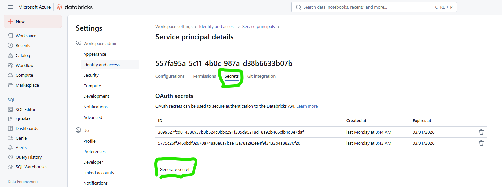
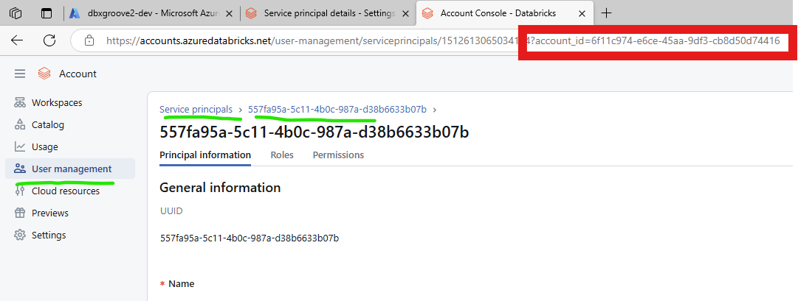

# How to promote or push your notebooks and python files to a Databricks workspace using CI/CD or devops
We are running pipelines from Azure Devops and GitHub Actions to demonstrate how you can use the Databricks CLI capabilities like `databricks workspace` from the command line to copy files from your local or from your git repository to the Databricks workspace to any location you specify. You can set `--overwrite` to make sure that you overwrite any existing files there. 

# Prerequisites
- 2 Databricks workspaces. As I have set this up to mimic a Dev to Prod type promotion
- The Databricks workspaces need to have Unity Catalog (I set them up as Premium sku)
- You need access to the Account Dashboard (accounts.azuredatabricks.net)
- clone or fork from my repository so that you can make this your own and adjust values where you need to. 

## Setting this up for Azure Devops 
If you want to set this up like I did then you need to do two things on Devops. 
1. Create your Service Connection (which is an app registration in Entra ID) in Azure devops and give it Contributor rights over the Resource Groups that contain your Dev and Prod databricks worksapces
1. You will need to have Pipeline library variable groups named the same as mine, or adjust the code to suit the name of your libraries. 

My libraries are called Dev-vars and Prod-vars. Inside these libraries are the secrets `databricksClientSecret: $(databrickstoken-appreg-srvcondevops-dev)` (and one for prod) which I created in the Databricks workspaces. 

### 1. Create your secret tokens in both dev and prod and save the secret in the Library groups
Go the dev workspace and navigate to Settings/Identity and access/Service Principals/Manage. If your SPN (Service Principal) has not been added, then add it. It will be a EntraID managed principal, you will need a Application ID of the SPN. I added the same SPN that I used as the Service Connectionn SPN in Azure Devops. 

Click on the Service principal and then look for the tab "Secrets". You need to create a secret on EACH databricks workspace, then save that secret to your Pipeline Library under the name `databrickstoken-appreg-srvcondevops-dev)` and `databrickstoken-appreg-srvcondevops-prod)` respectively, in the correct Variable groups.

### 1. Look for your SPN's account ID
You will need access to accounts.azuredatabricks.net (or ask your companies admin to go to this site and get the Account ID for you)

Go to User Management/Service Principals/ then click on your SPN name, then look in the URL for the account_id=xxxxx and copy this ID number.

In the `dbx-using-cicdtools-azdevops/env-variables.yml` file, add your account ID to the variable `dev-databricks-sp-accountid` and `prod-databricks-sp-accountid`. At this point its up to your company to decide whether you will use the same SPN to promote code to both DEV and Prod. If you choose to have different SPN's do the work, then you can easily adjust the yaml files and create secrets and service connections for the different SPN's. 

For example you would have different service connection names in both `dev-service-connection-name` and `prod-service-connection-name` in the env-variables.yml file. (and in the -clientid variable) 

### 1. Set up your Azure Devops pipeline
Go to Pipelines/New pipeline. Then select Github yaml, then select the repository that you cloned/forked from my repo. 

Then select "Existing yaml file" and look for the ymal file named "cicd-pipelines.yml". 

* Currently the Azure Devops is going through my personal clintgrove organisation. It is deploying to Databricks on my Visual Studio Subscription. 

## Github actions

* Thanks to https://endjin.com/blog/2019/09/import-and-export-notebooks-in-databricks for the idea on setting up Github actions. 

### Action variables
[go to settings and actions/sercrets and variables](./images/actionssecrets.png)
Gather up information on your application id (which you will set as your client_id). Find your Tenant ID by searching "Tenant properties" in Azure portal. Then add these to your Github actions like you see below

[add these secrets](./images/listofvariablessecrets.png)

The reason you will not need a Client secret is because the best way to set this up is to use "Federated credentials". It is simple to set up a handshake between your application registration (SPN) and your Github repository. Go ahead and set it up and it will look something like this. 

[create handshake between app id and github](./images/federated%20credential%20github%20app%20id.png)
 
Note to self (It is deploying to Databricks on Microsoft Non-production.)

 ## Asset Bundles
 These are pointing to my Contoso tenant.
