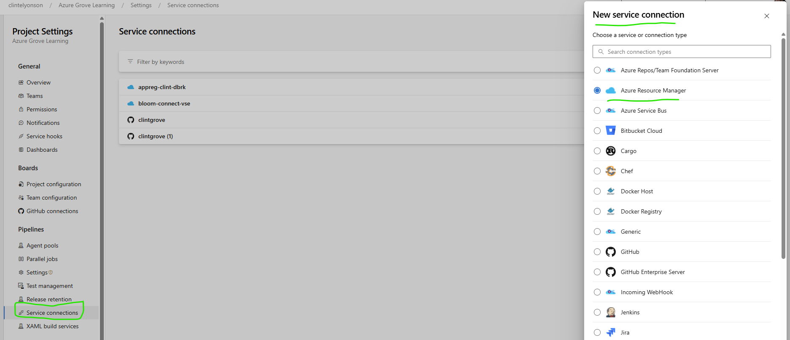
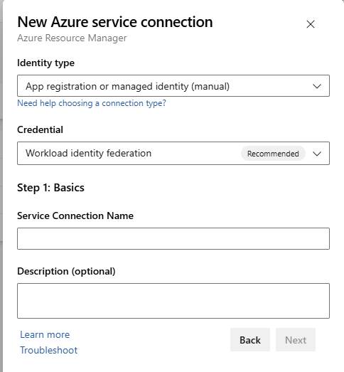
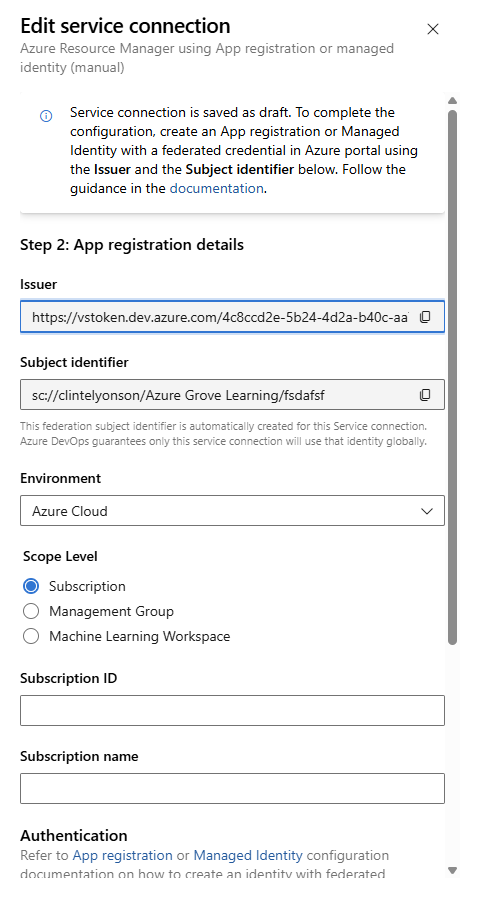
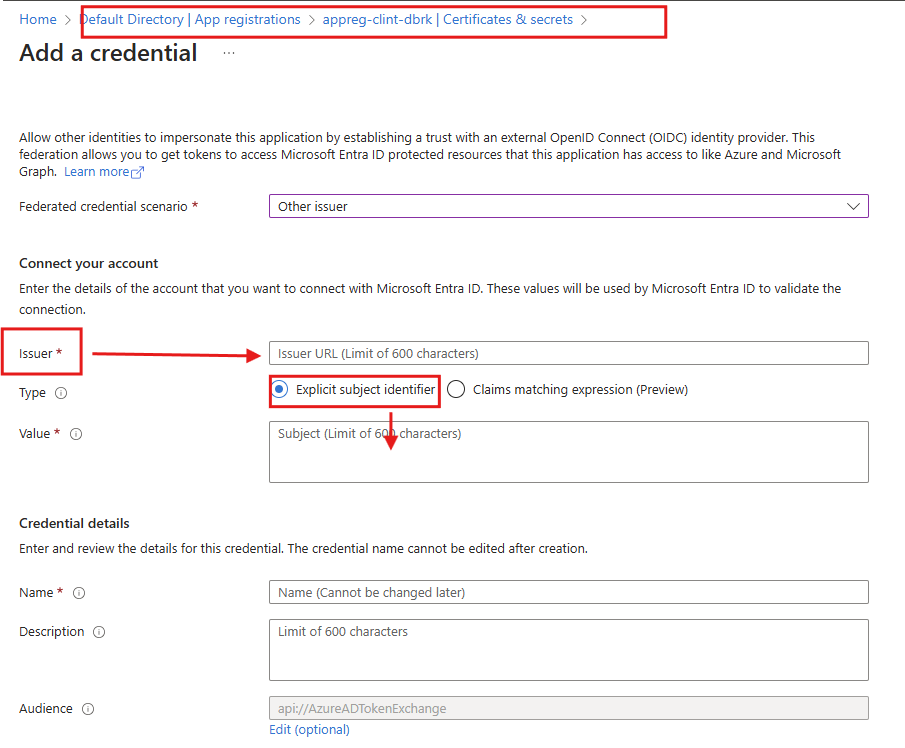
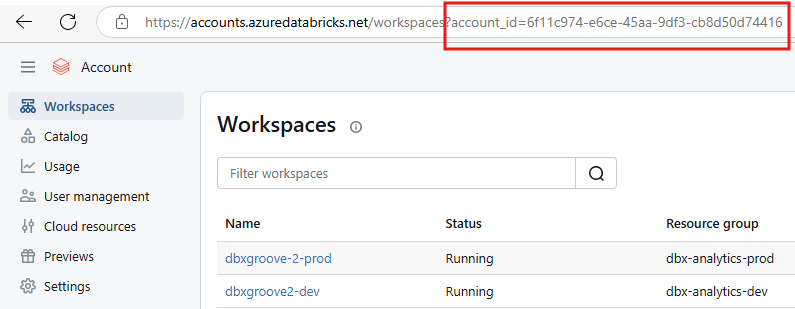
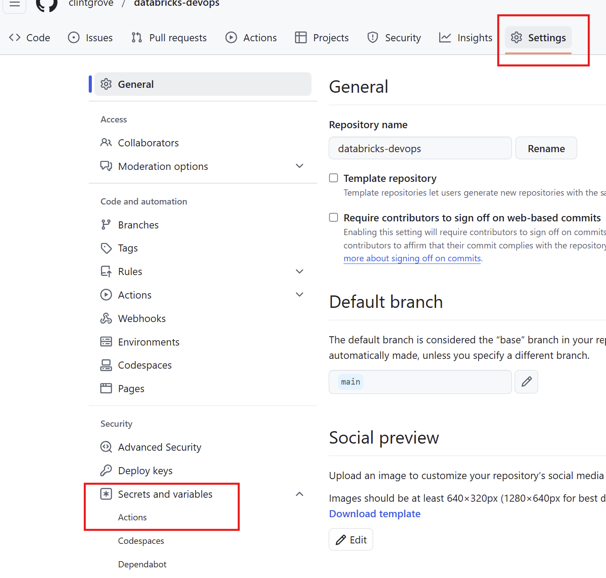
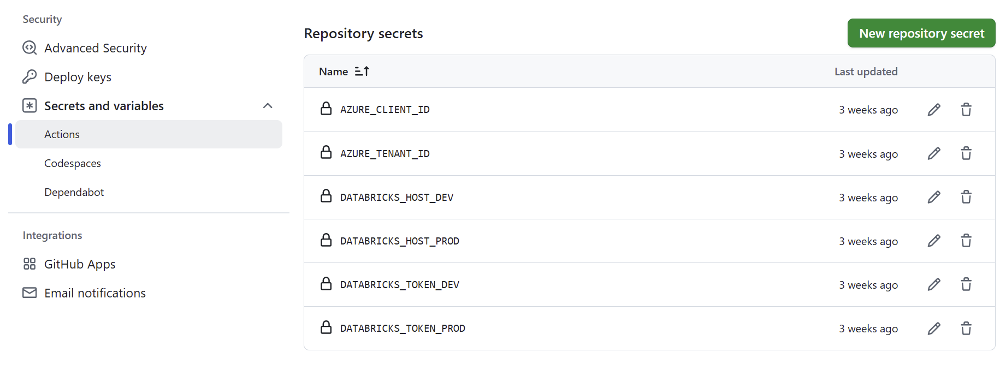

# How to promote or push your notebooks and python files to a Databricks workspace using CI/CD or devops
We are running pipelines from Azure Devops and GitHub Actions to demonstrate how you can use the Databricks CLI capabilities like `databricks workspace` from the command line to copy files from your local or from your git repository to the Databricks workspace to any location you specify. You can set `--overwrite` to make sure that you overwrite any existing files there. 

The command we want to use for Azure Devops is: 
`databricks workspace import_dir $(Build.SourcesDirectory)/${{ parameters.notebooksPath }} /Shared/live4 --overwrite`

If you are using Github Actions then it is:
`databricks workspace import_dir --overwrite ${{ inputs.notebooksPath }} /Shared/live4`

where the `/Shared/live4` can be any name you want, it doesn't have to be that. Also you can put it in `/Users/live` or `/Users/assets/notebooks` if you wanted to. 

Workspaces have these folders by default: 
    
-   /Users 
-   /Repos
-   /Shared 

(_Note: When I used my high permissions SPN that is Contributor over my entire Subscription then I could put the "/live" folder at the root level, but when I created a SPN that had limited scope and permission then I had to put it in /Users or /Repos or /Shared._)

# Prerequisites
- 2 Databricks workspaces. As I have set this up to mimic a Dev to Prod type promotion
- The Databricks workspaces need to have Unity Catalog (I set Databricks up on Premium sku)
- You need access to the Account Dashboard (accounts.azuredatabricks.net)
- Clone or fork from my repository so that you can make this your own and adjust values where you need to. 

## Setting this up for Azure Devops 
If you want to set this up like I did then you need to do two things on Devops. 
1. Create your Service Connection (which is an app registration in Entra ID, aka a SPN (Service Principal)) in Azure devops 
2. Add the SPN to the Databricks workspace
3. Find the "Account ID" of Admin Dashboard (accounts.azuredatabricks.net)
4. Create your Azure Devops Pipeline and run it

My libraries are called Dev-vars and Prod-vars. Inside these libraries are the secrets `databricksClientSecret: $(databrickstoken-appreg-srvcondevops-dev)` (and one for prod) which I created in the Databricks workspaces. 

### 1. Set up a "Service Connection" in Azure Devops

Go to Project Settings in Azure Devops (look down at the bottom left of the page). I set my Service Connection up manually, which meant that I already had an app registration (aka SPN) created in EntraID and then connected to that SPN as a "Service Connection" in Azure Devops. I prefer doing it that way so that I can control the app registration process instead of letting Azure Devops create one for me. 

Then click on the drop down for Identity Type and choose "manual" if you want to use an existing SPN (or automatic if you want to let Devops create one for you).

The "issuer" and the "Subject identitfier" in the next step is related to creating a federated credential on your SPN

The values that this window above gives for Issuer and Subject identifier is something you need to enter into your Credentials and Secrets page of your app registraition (SPN) in EntraID. See the screenshot below for hints. 

I wont go into too much detail, but here is a site that may help https://learn.microsoft.com/en-us/azure/devops/pipelines/library/service-endpoints?view=azure-devops

### 2. Setting for the SPN on the Databricks workspace

You now need to create secret tokens in both dev and prod (* and save the secret in the Library groups, see point 4).

Go the Databricks dev workspace and navigate to Settings/Identity and access/Service Principals/Manage. If your SPN (Service Principal) has not been added, then add it. When adding a new SPN, you will be adding an EntraID managed principal.

You will need the Application ID of the SPN. I added the same SPN that I used as the Service Connectionn SPN in Azure Devops. 

Click on the Service principal and then look for the tab "Secrets". You need to create a secret on EACH databricks workspace, then copy that as you will need to save that secret to your Pipeline Library under the name `databrickstoken-appreg-srvcondevops-dev)` and `databrickstoken-appreg-srvcondevops-prod)` respectively, in the correct Variable groups (see point number 4.1 below).

Its up to your company to decide whether you will use the same SPN to promote code to both DEV and Prod. If you choose to have different SPN's do the work, then you can easily adjust the yaml files and create secrets and service connections for the different SPN's (See the env-variables.yml to see my set up).

For example you would have different service connection names in both `dev-service-connection-name` and `prod-service-connection-name` in the env-variables.yml file. (and in the -clientid variable). 

From what I can tell there is no need to set RBAC permissions in Azure portal in the Resource goup or on the Resource (Databricks) for this to work. All you need to do is create a secret token inside the databricks workspace using the SPN, then add that secret to the Library variable and be sure to add the SPN's app id to the env-varibles.yml for the databricks workspace in question. 

### 3. Look for your Databricks Account ID
You will need access to accounts.azuredatabricks.net (or ask your companies admin to go to this site and get the Account ID for you)

You will see the account_id=xxxxx in the URL for most pages you navigate to in the Account dashboard. Copy this ID number.

In the `dbx-using-cicdtools-azdevops/env-variables.yml` file, add your account ID to the variable `dev-databricks-sp-accountid` and `prod-databricks-sp-accountid`. 

### 4. Set up your Azure Devops pipeline
#### 4.1 Create the library and variables
You will need to create Pipeline Library variable groups named the same as mine, or adjust the code to suit the name of your libraries. (Look for `- group: Dev-vars` this is the name of the Library group in Devops). 

Add the secret tokens that you created for the SPN's 

#### 4.2 Create the pipeline
Go to Pipelines/New pipeline. Then select Github yaml, then select the repository that you cloned/forked from my repo. 

Then select "Existing yaml file" and look for the ymal file named "cicd-pipelines.yml". 

* Currently the Azure Devops is going through my personal clintgrove organisation. It is deploying to Databricks on my Visual Studio Subscription. 

## Github actions

* Thanks to https://endjin.com/blog/2019/09/import-and-export-notebooks-in-databricks for the idea on setting up Github actions. 

### Action secrets and variables

In your repo, navigate to Settings, then look for Security/Secrets and variables and click on "Actions". 

Gather up information on your application id (which you will set as your client_id). Find your Tenant ID by searching "Tenant properties" in Azure portal. Then add these to your Github actions like you see below

The reason you will not need a Client secret is because the best way to set this up is to use "Federated credentials". It is simple to set up a handshake between your application registration (SPN) and your Github repository. Go ahead and set it up and it will look something like this. 

 
Note to self (It is deploying to Databricks on Microsoft Non-production.)

 ## Asset Bundles
 These are pointing to my Contoso tenant.
